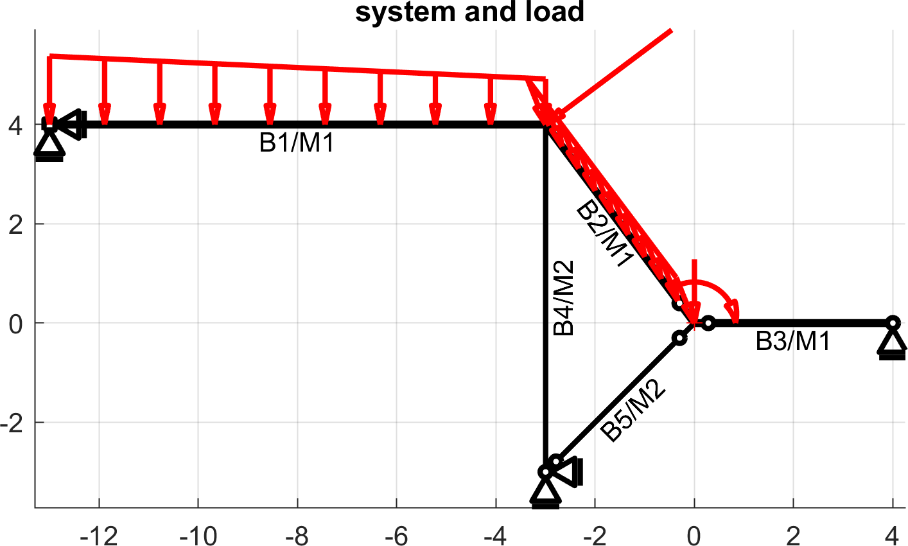
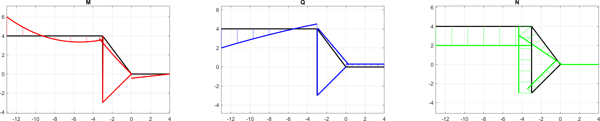

# F2d: matrix stiffness analysis for engineers

`F2d` is an implementation of the matrix stiffness method in Matlab/Octave. Unlike most other implementations out there, this one does not stop at the computation of nodal displacements. `F2d` also computes internal forces and reaction forces out of the box. For downstream-applications, it also supports the evaluation of displacements (in local and global coordinates) and internal forces at arbitrary points along the beam. 
The relatively slim code-basis allows easy customization, extension and integration into real-world engineering applications.

Here are the features at a glance:

* intuitive and efficient syntax for input files 
* rotated supports with optional stiffness
* (possibly rotated) beam-end hinges (displacement- and rotation hinges) specifiable in global- and beam-local direction
* direct computation of reaction forces
* evaluation of section forces:
    * on any location via `polyval`
    * beam-end values
    * local extrema and their location
* graphical output for checking the correctness of input file
* results easily accessible via an intuitive data structure

## Why yet another implementation?

The existing publicly available codes did either not provide the features I needed and/or were too complex to adapt to my needs. 

## How can I use it?

### Installation 

Download the project as a ZIP file (or clone the git repo) to a location on your computer. In Matlab, add the `F2d` folder to your path. Done!

### Running a Computation

Open and run the [`example.m`](example.m) script to see how `F2d` can be used. This loads an input file, displays the system, runs the computation and plots the results on screen and console.
The example is pretty self-explanatory, so go ahead and explore the program from there.

*above: example system with load*

*above: results (internal forces) of example system*

### Input File Syntax

See the input file [100.inp](autotests/testsystems/100.inp) for a commented example.

<!--
## Application Example
I personally wrote `F2d` to help me producing example frame systems for my [book](https://www.amazon.com/Structural-Analysis-Made-Easy-calculating/dp/1726705684). This includes the fully automated creation of the system drawing as well as readable results of internal force diagrams and reaction forces

XXX: sample images

(The code to produce the graphics is not open-source though.)
-->

## Contributions

If you have implemented a feature that you think others find useful too, send me a pull-request. If you *need* a feature implemented for you, feel free to contact me directly.

## Disclaimer 

*This software are rigorously tested, but mistakes can slip through anyways. Hence, use of this software is at your own risk! I can not be held liable for damages resulting from using this software. See also the [license terms](LICENSE) for details.*
